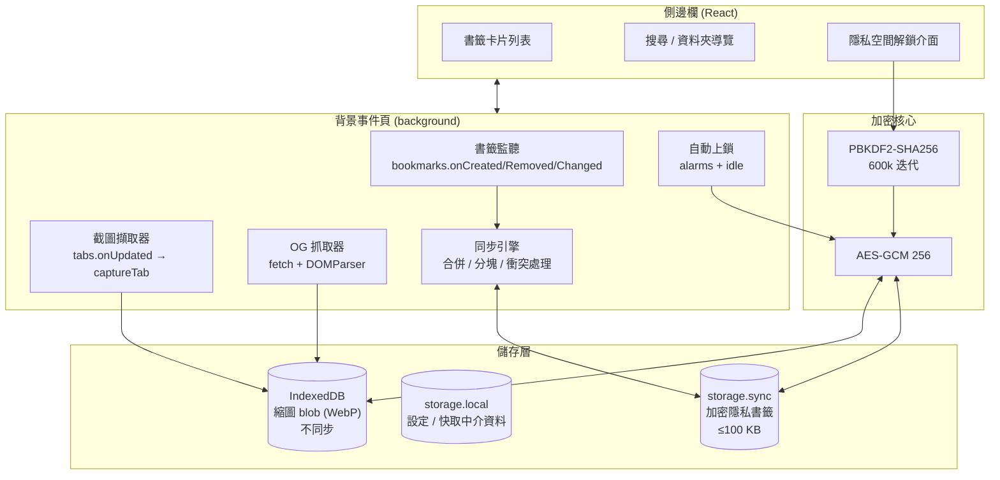

# 書籤預覽 + 隱私空間 — Firefox 擴充套件規劃

## 1. 產品範圍

一個 Firefox 側邊欄擴充套件，做兩件事：

1. **視覺化書籤瀏覽** — 側邊欄以縮圖卡片呈現書籤，而非純文字清單。預覽圖以「本機自動截圖優先、OG image 補位、favicon 墊底」的混合管線產生。
2. **隱私空間** — 指定書籤可移入受密碼保護的加密空間。這些書籤會從 Firefox 原生書籤樹中**移除**，以 AES-GCM 加密後存於擴充套件儲存區，只有解鎖後才在我們的 UI 中出現。

### 技術決策（已確認）

| 項目 | 選擇 |
|---|---|
| UI 形態 | `sidebar_action` 側邊欄 |
| 技術堆疊 | React + Vite + TypeScript |
| 預覽來源 | 混合：截圖優先 → OG image → favicon 卡片 |
| 隱私強度 | 移出原生書籤 + 主密碼 AES-GCM 加密 |
| 跨裝置同步 | `storage.sync`（分塊加密）+ 加密檔匯出 |

---

## 2. 架構總覽



**核心原則：截圖永不同步。** 縮圖體積大（每張 WebP 約 20–60 KB），且可在每台裝置上各自重新產生。只有書籤本身的中介資料需要跨裝置。這個切分是整個同步方案能成立的前提。

---

## 3. 隱私空間設計

### 3.1 加密方案

```
主密碼 ──PBKDF2-SHA256(salt, 600,000 iter)──> 256-bit 金鑰 (CryptoKey, non-extractable)
                                                    │
              ┌─────────────────────────────────────┼──────────────────────────┐
              ▼                                     ▼                          ▼
     隱私書籤集合 JSON                        隱私書籤縮圖                 驗證器 blob
     gzip → AES-GCM → 分塊                  AES-GCM → IndexedDB          （已知明文加密）
              ▼                                                                ▼
        storage.sync                                                    用於驗證密碼正確
```

- **KDF 用 PBKDF2-SHA256 / 600k 迭代**，而非 Argon2。原因：Web Crypto 原生支援 PBKDF2，Argon2 需要引入 WASM 依賴，對一個以隱私為賣點的擴充套件來說，減少第三方二進位依賴比 KDF 理論強度更值得。600k 迭代是 OWASP 目前對 PBKDF2-SHA256 的建議值。
- **金鑰以 `extractable: false` 的 `CryptoKey` 持有**，只存在背景頁記憶體中，永不寫入任何儲存區。
- **salt 明文存 `storage.sync`**。這是必要且安全的 —— 沒有共享 salt，同一組密碼在不同裝置會派生出不同金鑰，同步就無從解密。
- **驗證器（verifier）**：用金鑰加密一段固定已知明文並存下。解鎖時嘗試解密它即可判斷密碼是否正確，不必先解密整包資料。

### 3.2 關鍵細節：隱私書籤的縮圖也必須加密

如果隱私書籤的預覽截圖以明文躺在 IndexedDB 裡，那麼**整個加密設計就白做了** —— 任何能翻擴充套件儲存目錄的人，直接看圖就知道內容。所以：

- 隱私書籤的縮圖存在獨立的 IndexedDB store，blob 經 AES-GCM 加密。
- 上鎖狀態下，這些縮圖不解密、不渲染。
- 一般書籤的縮圖維持明文（效能考量，且它們本來就在原生書籤裡看得到）。

### 3.3 跨裝置同步

| 方案 | 容量 | Android | 需自架 | 建議 |
|---|---|---|---|---|
| **A. `storage.sync` 分塊加密** | ~500–1500 筆 | ❌ 不支援 | 否 | **主方案** |
| **B. 加密檔匯出／匯入** | 無上限 | ✅ | 否 | **必做**（兼災難備份） |
| C. WebDAV / 自架後端 | 無上限 | ✅ | 是 | 撞到配額或需要手機時再做 |
| ~~D. 藏在原生書籤標題~~ | 無上限 | ✅ | 否 | **排除** — 見下方說明 |

#### 實作時的架構調整：主儲存改放 storage.local

原規劃把隱私書籤直接存在 `storage.sync`，那會讓**能存多少**被 100 KB 綁死。實作時改成：

- **主儲存 = `storage.local`**（搭配 `unlimitedStorage`，實務上無容量上限）。隱私書籤數量不受限。
- **`storage.sync` 只放一份加密副本**（M4）。100 KB 額度只約束「能同步多少」，不約束「能存多少」；超過就提示使用者改用方案 C 或只靠加密檔備份。

分塊邏輯因此也只在寫入 sync 時才需要，本機存的是單一 blob。

#### 方案 A 的容量計算

`storage.sync` 實測配額（MDN 查證）：總量 102,400 bytes、單筆 item 8,192 bytes、最多 512 筆 item。

作法是**不要一個書籤存一筆 item**（會同時撞到 512 上限與 key 開銷），而是：

```
隱私書籤集合 JSON  ──gzip──>  AES-GCM  ──base64──>  切成 ~7.5 KB 塊
                                                          ▼
                                          pv_0, pv_1, ... pv_13  (≤ 100 KB)
```

單筆書籤記錄（url + title + folder + updatedAt + tags）約 150–250 bytes JSON。網址與標題的重複性高，gzip 壓縮率約 3:1。100 KB 的 base64 ≈ 75 KB 密文 ≈ 225 KB 明文 → **約 500–1500 筆**。

`CompressionStream('gzip')` 需 Firefox 113+，實作時確認目標版本。若不壓縮則降為約 350–500 筆，仍屬可用。

#### 方案 A 的四項代價（必須在 UI 中對使用者說明）

1. **主密碼不同步**，每台裝置需手動輸入一次。
2. **需登入 Firefox 帳號**，且 `about:preferences#sync` 中「附加元件」須勾選。未勾選則完全不同步 —— 設定頁要能偵測並提示此狀態。
3. **Firefox for Android 完全不同步 `storage.sync`**（Mozilla bug 1625257）。手機需求只能靠方案 B / C。
4. **同步週期 10 分鐘**，多裝置並行編輯會衝突。

#### 衝突處理

整塊 last-write-wins 會掉資料，因此資料模型必須支援逐筆合併：

- 每筆記錄帶 `id`（UUID）與 `updatedAt`（毫秒時戳）。
- 刪除不移除記錄，改寫入 `deleted: true` 墓碑，保留 30 天後才實體清除。
- 合併規則：以 `id` 為鍵，取 `updatedAt` 較大者勝；墓碑與編輯衝突時墓碑優先（刪除意圖優先於編輯，避免「以為刪了卻復活」）。
- 寫入前先 `sync.get` 讀取遠端、合併、再 `sync.set` 寫回。

#### 為何排除方案 D

把加密 blob 塞進原生書籤標題、藉 Firefox Sync 原生搬運，可繞過配額限制。但書籤管理器中會出現一排亂碼項目 —— 內容雖讀不出來，卻**洩漏了「此人有隱私空間」以及其中的項目數量**。這與本專案目標直接衝突。

### 3.4 上鎖行為

實作時發現 MV3 事件頁逼出一個額外需求：**事件頁閒置約 30 秒就被卸載，記憶體中的金鑰會跟著消失**，表現成「才剛解鎖就自己鎖回去」。解法是側邊欄在解鎖期間維持一條 `runtime.connect()` port，讓事件頁保持存活；連線中斷（側邊欄關閉）就上鎖 —— 那本來也正是我們想要的行為。

這裡有個實作陷阱值得記下：port 斷開就立刻上鎖會造成**每做一個操作就自己鎖起來**。因為側邊欄每次 `vault/changed` 廣播都會重新渲染，若 effect 依賴整個 state 物件，會先斷舊 port 再接新的，背景頁在那個空隙看到連線數歸零就上鎖。兩邊都要修：effect 只依賴 `status` 字串，且背景頁在連線歸零後留 1.5 秒寬限期。

- 預設閒置 5 分鐘自動上鎖（`idle` API），可設定。
- 瀏覽器關閉即上鎖（金鑰只在記憶體）。
- 手動上鎖按鈕。
- **上鎖時清空 React 端所有已解密狀態**，而非只是切換一個顯示旗標 —— 否則 DevTools 仍可讀出資料。

### 3.5 進入隱私空間的書籤，其生命週期

```
一般書籤 ──「移入隱私空間」──> 1. 讀取完整記錄
                                2. 加密寫入 storage.sync
                                3. 加密其既有縮圖
                                4. bookmarks.remove() 移出原生書籤樹  ← 不可逆，需二次確認
                                5. 從瀏覽記錄中一併移除？（詢問使用者）
```

第 5 步是待確認項目 —— 見第 10 節。

---

## 4. 預覽管線設計

### 4.1 三層 fallback

| 優先序 | 來源 | 觸發時機 | 呈現方式 |
|---|---|---|---|
| 1 | **內容封面圖**（從已渲染的分頁 DOM 擷取） | 你正常瀏覽到已加入書籤的頁面時 | 維持原始長寬比，完整顯示 |
| 2 | 網頁截圖（`tabs.captureVisibleTab`） | 頁面沒有可辨識的封面圖 | 裁切成 16:9 填滿 |
| 3 | 網域色卡 | 前兩者皆失敗 | 純視覺佔位 |

**封面圖排在截圖之前，是使用回饋後的方向修正。** 對漫畫、影片、書籍、商品這類「內容頁」，頁面上的封面遠比一張網頁截圖更能代表這個書籤 —— 截圖裡通常只看到導覽列與一小塊內容。反之文件站、後台頁面沒有有意義的封面，那裡截圖才有用，所以保留為第二層而不是取消。使用者可在側邊欄底部切換「封面優先／截圖優先」。

### 4.1.1 為什麼封面要從「已渲染的分頁」擷取，而不是重新 fetch 網址

原本的 OG 抓取是從背景頁 `fetch()` 書籤網址再解析 HTML。實測目標站台（一個漫畫站）發現這條路走不通，兩個原因各自都足以致命：

1. **前端渲染的站台什麼都拿不到。** 伺服器回的 HTML 裡沒有封面，圖是 JS 跑完才插進 DOM 的。
2. **Cloudflare 之類的防護會擋掉。** 該站對背景頁的 fetch 直接回「Attention Required!」驗證頁，連 HTML 都拿不到。

改用 `scripting.executeScript` 注入一小段函式到**使用者正在看的那個分頁**裡讀 DOM。那個分頁已經通過驗證、已經跑完 JS，而且不必再發一次頁面請求。

伺服器端的 OG 抓取保留給「手動補抓從未造訪過的書籤」—— 那時沒有已開啟的分頁可用，只能盡力而為。

### 4.1.2 封面候選的判定順序

注入的函式依可信度收集候選，取前五名交給背景頁逐一嘗試下載：

1. 站方明確宣告的預覽圖：`og:image`、`twitter:image`、`itemprop=image`、`link[rel=image_src]`
2. JSON-LD（schema.org）的 `image` / `thumbnailUrl` / `poster` —— 漫畫站常用 `Book` / `ComicSeries`，影音站用 `VideoObject` / `Movie`
3. `<video poster>`
4. **什麼都沒宣告時的啟發式**：找頁面上最像封面的圖片。這是漫畫站最常見的情況。評分方式：面積 × 直式加成（比例 < 0.9 給 1.6 倍，因為書籍與漫畫封面幾乎都是直式）× 靠上加成。並排除自然尺寸 < 120px 的圖示、實際未顯示的圖、長寬比超過 4:1 或低於 1:4 的橫幅與細長裝飾、以及距頁首超過 2000px 的推薦列表。

啟發式的正確性有一份 fixture 驗證（`tests/fixtures/site/`，用 `scripts/serve-fixture.sh` 提供）：一個完全沒有中介資料的頁面，同時放了 900×90 橫幅廣告、200×300 直式封面與 32×32 小圖示，擷取結果必須是封面。

### 4.1.3 封面圖不裁切

截圖統一裁成 16:9 是為了讓清單排列整齊，但**封面圖一旦被裁成 16:9 就只剩最上面一條**。漫畫與書籍封面幾乎都是直式，影片封面又是橫式，硬套同一個比例會毀掉整張圖。

所以封面圖只做等比縮小（長邊上限 480×720），並把原始尺寸一併存進 `ThumbRecord`；大卡模式下卡片採用圖片自己的長寬比（`aspect-ratio` 由 CSS 變數傳入），並設 320px 高度上限避免超高的圖把清單其他項目推出視野。

### 4.2 截圖擷取流程

```
tabs.onUpdated (status === 'complete')
  ├─ 是隱私瀏覽視窗？          → 中止（絕不擷取）
  ├─ 網址在使用者黑名單？       → 中止
  ├─ bookmarks.search(url) 命中？→ 否則中止
  ├─ 既有快取仍新鮮（< N 天）？  → 中止
  └─ 延遲 1.5s（等圖片/字體載入）
       → tabs.captureTab(tabId)
       → OffscreenCanvas 降尺寸至寬 640px
       → 轉 WebP quality 0.8
       → 寫入 IndexedDB（隱私書籤先加密）
```

**設計取捨：** 截圖是被動累積的，所以新裝好的擴充套件一開始幾乎沒有預覽圖。因此需要一個「手動補抓」功能，必須是使用者明確觸發，不能自動跑。

實作時把補抓改成**用 OG 抓取而非「在隱藏分頁逐一開啟書籤再截圖」**：後者要開關數百個分頁、會執行頁面腳本、耗時長得多，而 OG 圖正好就是第二層 fallback。原規劃的做法成本遠高於收益。

### 4.4 實作時撞到的兩個 API 現實

**`tabs.captureTab` 在 Firefox 153 已不存在。** 那是 Firefox 專屬 API，TypeScript 型別定義還留著，執行期會丟 `is not a function`。改用標準的 `tabs.captureVisibleTab(windowId, options)` —— 它只能擷取視窗當前可見的分頁，正好符合我們「只截作用中分頁」的設計，沒有功能損失。

**`captureVisibleTab` 的可用性由字面上的 `<all_urls>` 決定，且必須在 context 建立時就已授予。** 兩件事各自都會讓它「不存在」：

1. **權限樣式必須是字面上的 `<all_urls>`。** 一度為了避免 Firefox 額外索取「存取您電腦上的檔案」而改用 `*://*/*`，結果 `captureVisibleTab` 永遠不會出現在 API 表面 —— 即使權限已授予、即使重啟瀏覽器。Firefox 對這個 API 的 gating 認的是 `<all_urls>` 本身，等價的萬用樣式不算。
2. **WebExtension 的 API 表面是依「該 context 建立時已授予的權限」計算的。** 背景頁若在沒有權限時啟動，事後授權**不會**補進已建立的 API 物件。

解法：`optional_host_permissions: ["<all_urls>"]`，並在背景頁監聽 `permissions.onAdded`，偵測到「已有權限但 API 仍不存在」時呼叫 `browser.runtime.reload()`。這只會在剛授權的那一次發生，重啟後條件不再成立，不會形成迴圈；此刻側邊欄也還沒有值得保留的狀態。**這條路徑已實機驗證可行**（授權 → 自動重啟 → 造訪已收藏頁面 → 縮圖出現）。

替代方案是把 host 權限改成必要，那樣一定可用且少一次重啟，但會犧牲「安裝時不索取全網站存取權」這個對隱私定位很重要的取捨。

### 4.5 為什麼需要「上次擷取狀態」的診斷

擷取完全被動發生，失敗時使用者只會看到「預覽圖一直沒出現」而無從得知原因。因此每次嘗試（含各種跳過的理由）都記錄到 `storage.local`，並在側邊欄底部以人話顯示值得打擾使用者的那幾種。

這不是事後補的除錯工具 —— 上面兩個 API 問題都是靠它才在數十秒內定位的，否則得去翻背景頁的主控台。

### 4.3 側邊欄的寬度限制

側邊欄典型寬度 320–420 px（可拖曳調整），這是選擇 sidebar 形態的主要代價。因應設計：

- **單欄卡片佈局**，縮圖佔滿側邊欄寬度（約 300 px 寬、169 px 高的 16:9），這個尺寸其實足以辨識頁面。
- **密度切換**：大卡（縮圖為主）／小列（64 px 縮圖 + 文字）／純文字。
- 點擊縮圖可展開大圖覆蓋層。
- 資料夾導覽用**麵包屑 + 扁平列表**，不用樹狀展開 —— 窄欄放不下縮排樹。
- 若日後覺得太窄，可加一個「在新分頁開啟完整預覽牆」的出口，沿用同一批元件。

---

## 5. 權限清單

### 必要權限

| 權限 | 用途 |
|---|---|
| `bookmarks` | 讀取書籤樹、移入隱私空間時移除 |
| `storage` | `storage.local` 設定 + `storage.sync` 加密資料 |
| `unlimitedStorage` | IndexedDB 縮圖可能累積至數百 MB |
| `tabs` | 監聽頁面載入完成、取得 tab 標題與 favicon |
| `alarms` | 自動上鎖計時、快取清理排程 |
| `idle` | 閒置自動上鎖 |

### 選用權限（`optional_host_permissions`，執行期才請求）

| 權限 | 用途 | 未授權時的降級 |
|---|---|---|
| `<all_urls>` | `captureTab` 截圖、fetch OG image | 只剩 favicon 卡片 |

把 `<all_urls>` 放在**選用**而非必要，是刻意的：安裝時不索取全網站讀取權，讓使用者在理解用途後才授權。對一個主打隱私的擴充套件，這個取捨值得付出「首次使用多一個步驟」的代價，也讓 AMO 審核更容易通過。

### manifest 必要設定

- `browser_specific_settings.gecko.id` — **`storage.sync` 在 Firefox 依賴 Add-on ID，未設定則完全無法運作。**
- `sidebar_action` — Firefox 原生支援（Chrome 對應的是 `sidePanel`，若日後要跨瀏覽器需分歧處理）。
- `background.scripts` 事件頁 —— Firefox 的 MV3 **不支援** `background.service_worker`（[Firefox bug 1573659](https://bugzil.la/1573659)）。事件頁載入傳統腳本，故背景必須打包成單一 IIFE 檔，與 ES module 頁面分開建置。
- `gecko.data_collection_permissions: { required: ["none"] }` —— 對新上架擴充套件為強制項。**此 key 需要 Firefox 140+，因此 `strict_min_version` 定為 140.0**（見第 10 節第 4 項）。

---

## 6. 資料模型

```typescript
// ── 同步（加密後存 storage.sync）─────────────────────────
interface PrivateBookmark {
  id: string;            // UUID，同步合併的鍵
  url: string;
  title: string;
  folderId: string | null;
  tags: string[];
  createdAt: number;
  updatedAt: number;     // 衝突解決依據
  deleted?: true;        // 墓碑，保留 30 天
}

interface PrivateFolder {
  id: string;
  name: string;
  parentId: string | null;
  updatedAt: number;
  deleted?: true;
}

interface VaultPayload {          // gzip → AES-GCM → 分塊 → storage.sync
  version: 1;
  bookmarks: PrivateBookmark[];
  folders: PrivateFolder[];
}

// ── 同步（明文存 storage.sync）───────────────────────────
interface VaultMeta {
  salt: string;          // base64，KDF 用，明文為必要且安全
  iterations: number;    // 記錄 KDF 參數以支援日後升級
  verifier: string;      // base64(AES-GCM(已知明文))
  chunkCount: number;
  payloadVersion: number;
}

// ── 本機（storage.local）──────────────────────────────────
interface ThumbMeta {
  bookmarkUrlHash: string;   // SHA-256(url)，作為 IndexedDB 鍵
  source: 'capture' | 'og' | 'favicon';
  capturedAt: number;
  width: number;
  height: number;
  encrypted: boolean;        // 隱私書籤的縮圖為 true
}

interface Settings {
  autoLockMinutes: number;
  captureEnabled: boolean;
  captureBlocklist: string[];   // 網域樣式
  thumbMaxAgeDays: number;
  density: 'card' | 'row' | 'text';
  syncEnabled: boolean;
}
```

IndexedDB：`thumbs` store，鍵為 `bookmarkUrlHash`，值為 `{ blob: Blob, iv?: Uint8Array }`。

---

## 7. 目錄結構

```
firefox_plugin/
├── manifest.json
├── vite.config.ts
├── tsconfig.json
├── package.json
├── src/
│   ├── background/
│   │   ├── index.ts              # 事件註冊入口
│   │   ├── bookmark-watcher.ts   # bookmarks 事件 → 快取失效
│   │   ├── capture.ts            # 截圖管線
│   │   ├── og-fetcher.ts         # OG image 抓取與解析
│   │   ├── sync-engine.ts        # 分塊 / 合併 / 衝突處理
│   │   └── lock.ts               # 自動上鎖
│   ├── crypto/
│   │   ├── kdf.ts                # PBKDF2 金鑰派生
│   │   ├── aead.ts               # AES-GCM 封裝
│   │   ├── chunk.ts              # 分塊與重組
│   │   └── vault.ts              # 高階 API：unlock / lock / read / write
│   ├── storage/
│   │   ├── thumbs-db.ts          # IndexedDB 存取層
│   │   ├── settings.ts
│   │   └── sync-store.ts
│   ├── sidebar/
│   │   ├── index.html
│   │   ├── main.tsx
│   │   ├── App.tsx
│   │   ├── components/
│   │   │   ├── BookmarkCard.tsx
│   │   │   ├── BookmarkList.tsx
│   │   │   ├── Breadcrumb.tsx
│   │   │   ├── SearchBar.tsx
│   │   │   ├── DensityToggle.tsx
│   │   │   ├── UnlockPrompt.tsx
│   │   │   └── VaultView.tsx
│   │   └── hooks/
│   │       ├── useBookmarks.ts
│   │       ├── useThumb.ts
│   │       └── useVault.ts
│   ├── options/                  # 設定頁：同步狀態、匯出匯入、黑名單
│   └── shared/
│       ├── types.ts
│       ├── messages.ts           # 背景 ↔ 側邊欄 訊息協定（型別化）
│       └── url.ts                # 正規化、雜湊
└── tests/
    ├── crypto.test.ts            # 加解密往返、錯誤密碼、分塊邊界
    └── sync-merge.test.ts        # 衝突情境
```

---

## 8. 分階段實作計畫

每個階段結束時都應該是**可安裝、可實際使用**的狀態，而不是半成品堆疊。

### M0 — 骨架可跑 ✅ 已完成
- Vite + React + TS + MV3 建置流程，產出可 `about:debugging` 載入的擴充套件
- 側邊欄顯示書籤樹（純文字，無縮圖）
- 型別化的背景 ↔ 側邊欄訊息協定
- **驗收：** 能在側邊欄看到並點開自己的書籤

### M1 — 預覽管線 ✅ 已完成
- IndexedDB 縮圖層
- `captureTab` 被動擷取 + 降尺寸 + WebP
- OG image fallback、favicon 墊底
- 卡片 UI、三段密度切換
- 手動補抓功能
- **驗收：** 瀏覽幾個已加書籤的網站後，側邊欄出現真實截圖

### M2 — 加密核心（無 UI）✅ 已完成
- PBKDF2 / AES-GCM / 分塊模組
- 單元測試：往返、錯誤密碼、分塊邊界、gzip 開關
- **驗收：** 測試全綠。這一階段刻意不碰 UI，因為加密錯誤的代價是永久資料遺失，必須先在測試中確立正確性

### M3 — 隱私空間（單機）✅ 已完成
- 建立主密碼、解鎖／上鎖、閒置自動上鎖
- 書籤移入／移出隱私空間（含二次確認）
- 隱私書籤縮圖加密
- **驗收：** 移入的書籤在 `Ctrl+Shift+O` 原生書籤管理器中確實消失；上鎖後 DevTools 讀不到明文

### M4 — 同步與備份（未開始，接手細節見 NEXT.md）
- `storage.sync` 分塊讀寫
- 逐筆合併與墓碑
- 加密檔匯出／匯入
- 設定頁偵測並提示 Firefox Sync 狀態、顯示配額用量
- **驗收：** 兩台裝置（或兩個 Firefox profile）能同步隱私書籤；配額接近上限時有警示

### M5 — 打磨與上架（未開始）
- 鍵盤操作、無障礙、深淺色主題
- 效能：大量書籤的虛擬滾動
- AMO 上架所需的隱私政策與權限說明
- **驗收：** 通過 `web-ext lint`

---

## 9. 已知風險與取捨

| 風險 | 影響 | 緩解 |
|---|---|---|
| **忘記主密碼 = 資料永久遺失** | 高 | 建立密碼時強制警示；強力推動加密檔匯出；不提供任何後門（有後門就不算加密） |
| `storage.sync` 100 KB 上限 | 中 | gzip 壓縮；設定頁顯示用量；接近上限時提示改用方案 C |
| Android 不同步 | 中 | 文件明示；提供加密檔匯入作為手機路徑 |
| 加密實作出錯導致資料損毀 | 高 | M2 先寫測試再接 UI；寫入前保留前一版本以供回滾 |
| 截圖累積佔用磁碟 | 低 | `thumbMaxAgeDays` 過期清理；設定頁顯示用量與手動清除 |
| AMO 審核對 `<all_urls>` 的疑慮 | 中 | 設為選用權限、提交清楚的用途說明 |
| 側邊欄過窄影響預覽體驗 | 低 | 密度切換 + 大圖覆蓋層；必要時加開新分頁預覽牆 |

---

## 10. 待確認事項

這些不阻擋 M0–M2 開工，但在 M3 之前需要你的決定：

1. ~~**移入隱私空間時，是否一併清除該網址的瀏覽記錄？**~~ **已按建議實作**：移入確認對話框中提供勾選項，**預設開啟**並明確告知。`history` 是選用權限，在按下「移入」時才請求（`permissions.request()` 必須在使用者操作的處理器中呼叫）。使用者若拒絕權限，書籤仍會移入，但 UI 會明確告知「該網址仍留在瀏覽記錄與網址列自動完成中」而不是假裝成功。

2. **隱私空間要不要支援多個獨立空間**（各自不同密碼）？現行設計是單一空間。改成多空間主要是資料模型與 UI 的擴充，但會吃掉更多 `storage.sync` 配額。

3. **是否需要「已加入書籤但從未造訪」的批次補抓在安裝時自動執行一次？** 這會對大量網域發出請求，我傾向**不自動執行**，只放一個明確的按鈕。

4. ~~**目標 Firefox 最低版本？**~~ **已確定為 140.0**（M0 實作時查證）。這不是選擇而是被規則決定的：`data_collection_permissions` 對新上架擴充套件是強制的，而該 key 需要 Firefox 140+。此下限同時覆蓋 `CompressionStream`（113+，方案 A 壓縮用）與 `optional_host_permissions`（116+）的需求，因此都不需要 polyfill。
