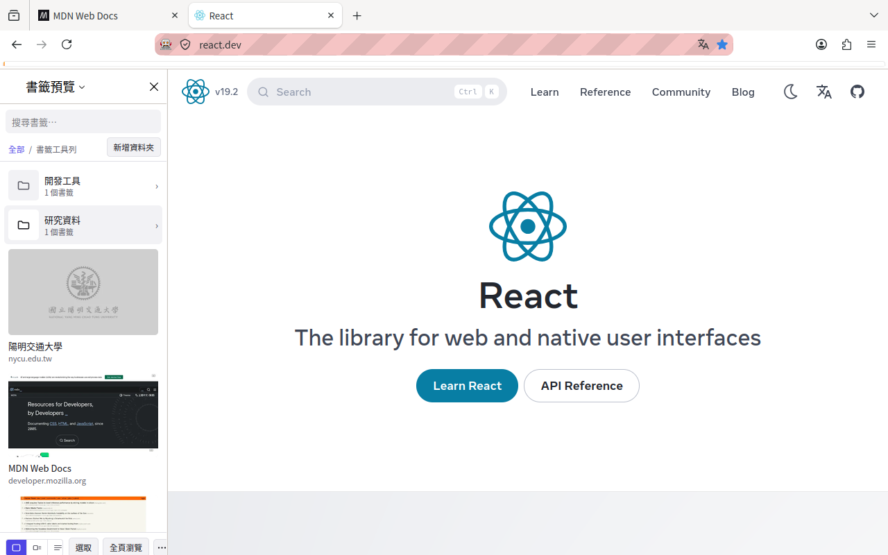
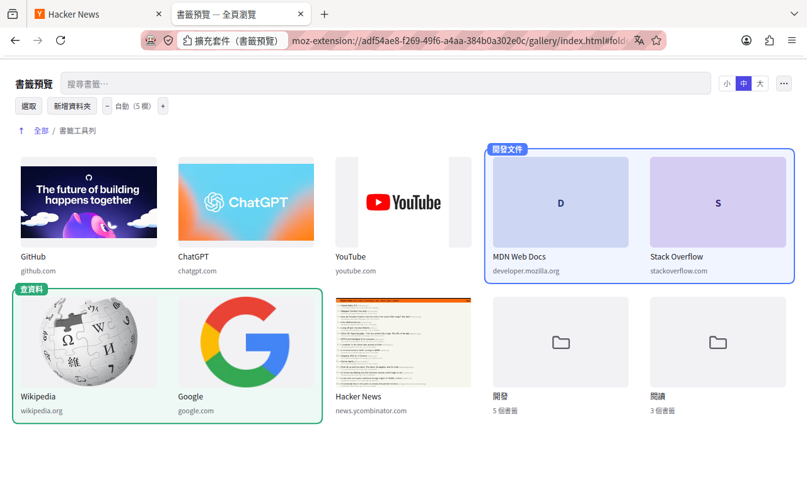
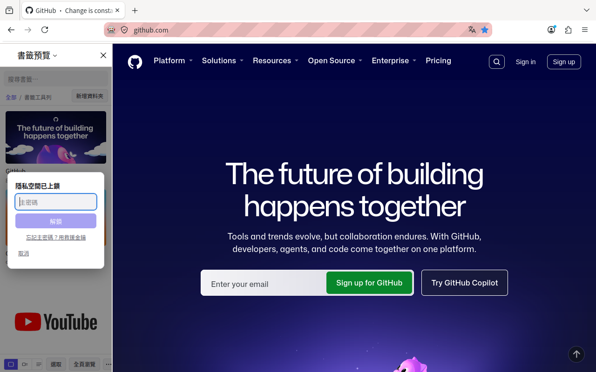

# Bookmark Preview

A Firefox sidebar extension that browses bookmarks as **visual previews** instead of a wall
of text, with a **password-encrypted vault** for the ones you would rather not have sitting
in the bookmark menu.

正體中文版：[README.zh-TW.md](README.zh-TW.md)



## What it does

**Visual previews.** The sidebar lists bookmarks with thumbnails in three densities (card
/ row / text-only). "Full page" lays them out as a grid across the whole window.

Previews prefer the page's **own cover art** — comic and book covers, video thumbnails —
and fall back to a screenshot only when there isn't one. The heuristics never look at the
domain, so there is no site list to maintain. When they get it wrong, right-click any
image on any page and choose "Use as this bookmark's preview".

**An encrypted vault.** Bookmarks moved into it are removed from Firefox's bookmark
manager, toolbar and menu; they are only visible after you unlock, and their thumbnails
are encrypted too (AES-256-GCM). Whole folders move in and out with their structure
intact.

The entrance is hidden by default — the sidebar shows no trace of it. You type a trigger
string of your own choosing into the search box to bring up the password screen. It
re-locks a configurable number of minutes after you last touched the vault, when you walk
away from the machine, or when you close the sidebar.

A forgotten master password **cannot be recovered**, so the vault hands you a recovery key
when you create it, exports an encrypted backup file, and can optionally keep an encrypted
copy in Firefox Sync for your own other devices.

**Everything stays on your device.** No server, no account, no telemetry of any kind. Data
leaves the machine only if you opt into sync, and then only as ciphertext.

**Fully keyboard operable.** Arrow keys to move, Enter to open, Right Arrow to enter a
folder, Backspace to go up, Menu key or `Shift+F10` for the context menu. Lists and grids
are virtualised, so a folder of 3,000 bookmarks paints in about 8 ms.

## Install

Not yet on [addons.mozilla.org](https://addons.mozilla.org/). To run it from source:

```bash
npm install
npm run build
```

Then open `about:debugging#/runtime/this-firefox` → "Load Temporary Add-on" → pick
`dist/manifest.json`.

Requires Firefox 140 or newer, desktop only (`sidebar_action` does not exist on Firefox
for Android).

## Documentation

| | |
|---|---|
| [docs/previews.md](docs/previews.md) | How a preview image is chosen, and why site-wide `og:image`s get demoted |
| [docs/vault.md](docs/vault.md) | The hidden entrance, the keyring, recovery keys, moving folders in and out |
| [docs/sync-and-backup.md](docs/sync-and-backup.md) | The backup file, cross-device sync, and the merge rules |
| [docs/interface.md](docs/interface.md) | Keyboard map, virtual scrolling, the toolbars, the full-page view |
| [docs/architecture.md](docs/architecture.md) | Build setup, source layout, the invariants worth knowing before changing things |
| [docs/permissions.md](docs/permissions.md) | Every permission and why it is needed |
| [docs/development.md](docs/development.md) | Building, testing on Windows, headless testing in a container |

`PLAN.md` holds the original design and staged plan; `NEXT.md` is the working handover
document (current state, what is verified against a real browser, and the traps in the test
environment). Both are in Traditional Chinese.

## Screenshots

| | |
|---|---|
|  |  |
| Full-page view — every cover at once | The vault entrance is hidden behind a trigger string |

## License

Copyright (c) 2026 andytw366

Licensed under the **Mozilla Public License 2.0**; the full text is in [LICENSE](LICENSE).

> This Source Code Form is subject to the terms of the Mozilla Public
> License, v. 2.0. If a copy of the MPL was not distributed with this
> file, You can obtain one at https://mozilla.org/MPL/2.0/.

MPL-2.0 rather than MIT: it is Mozilla's own license, a natural fit for a Firefox
extension, and its copyleft is **file-level** — changes to these files must be published,
but they can be combined with closed-source code. Looser than the GPL, and it keeps a
little more than MIT does.

**There are no per-file license headers, and that is deliberate.** MPL-2.0's Exhibit A
explicitly permits placing the notice "in a location (such as a LICENSE file in a relevant
directory) where a recipient would be likely to look for such a notice" instead of in every
file. The root `LICENSE` plus this section satisfies that; three lines of boilerplate
across seventy-odd files would be pure noise.

The only runtime dependencies are React and ReactDOM (MIT), which are compatible with
MPL-2.0.
